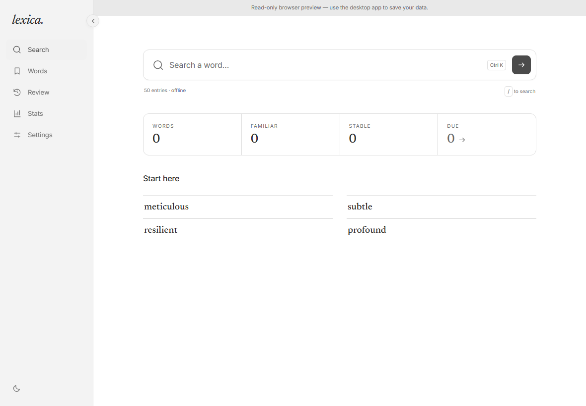
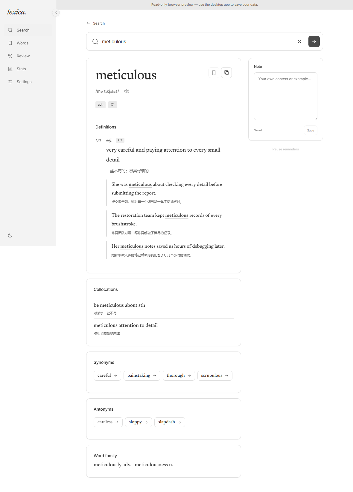
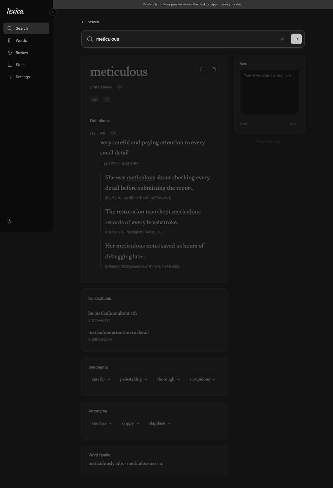
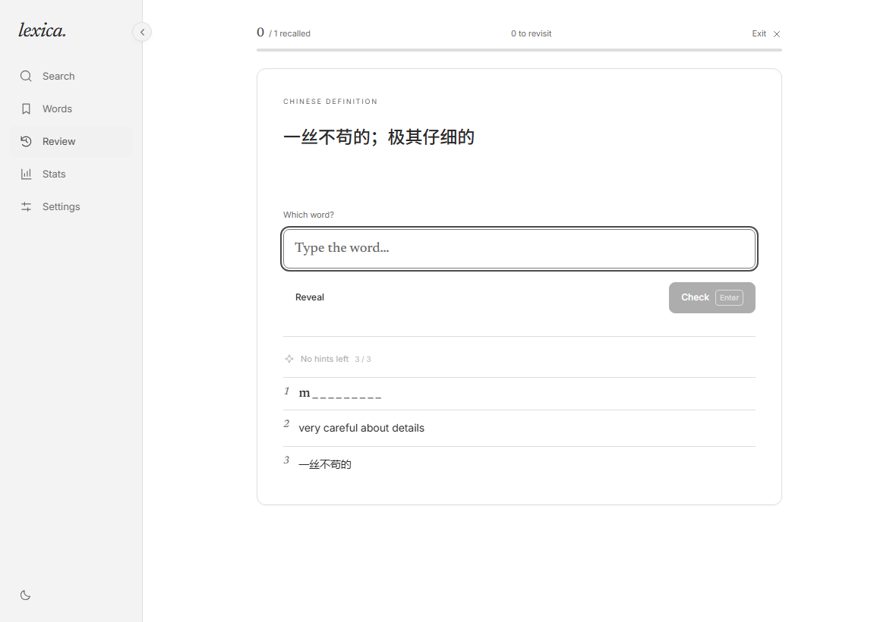
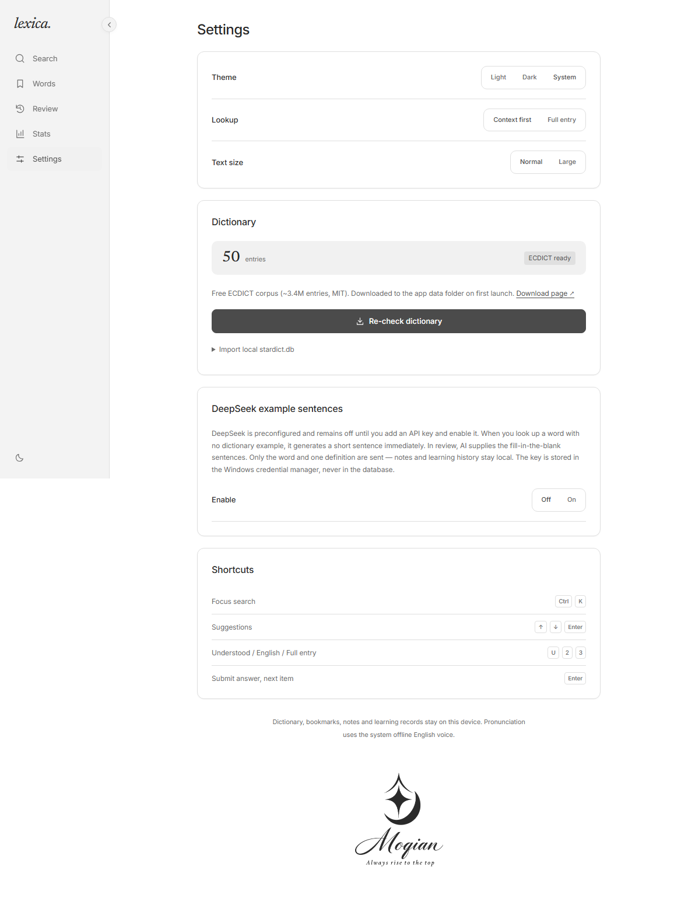
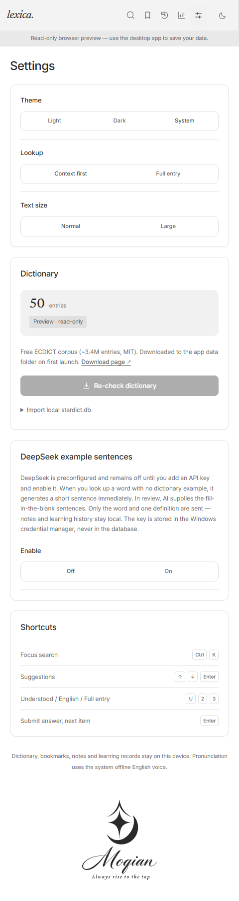

# Lexica.

> A local-first English dictionary that tries to make itself unnecessary.

[](https://github.com/YinLingxiao/Lexica./releases/latest)
[](https://github.com/YinLingxiao/Lexica./releases)


**Tauri 2 · Rust · SQLite / FTS5 · SvelteKit 5**

Look up a word. Understand it in context. Move on. Vocabulary, notes, and review schedules stay on this device.



---

## Download

Windows 10 / 11 (x64). WebView2 is usually already installed.

| File | Size | Notes |
| --- | --- | --- |
| **[Lexica-setup.exe](https://github.com/YinLingxiao/Lexica./releases/latest/download/Lexica-setup.exe)** | ~3.5 MB | **Recommended.** NSIS installer with Start Menu + desktop shortcuts |
| [Lexica.msi](https://github.com/YinLingxiao/Lexica./releases/latest/download/Lexica.msi) | ~5.3 MB | Better for silent / enterprise deploy |

These are permanent `latest` links. Pick a specific version on [Releases](https://github.com/YinLingxiao/Lexica./releases).

> The installer is currently **unsigned**. Windows SmartScreen may warn about an unknown publisher — choose **More info → Run anyway**.

---

## Features

### Dictionary

Prefix suggestions, inflection fallback (`running` → `run`), keyboard navigation, recent lookups, and deep links (`/?word=meticulous`). Bilingual senses, highlighted examples, collocations, synonyms / antonyms, word family, and one-click copy.

On first launch Lexica downloads the free **ECDICT** corpus (~3.4M entries, MIT) into the app data folder. You can also import your own `stardict.db` from Settings.

### Vocabulary

Bookmarks, private notes, search, filter by memory stage, pagination, and pause / resume review reminders.

### Review

Up to 12 due words per session. Progressive hints (first letter → English → Chinese), anti-double-submit, immediate feedback, and a short session summary.

### AI example sentences *(optional, off by default)*

- When a dictionary entry has no example, generate one short sentence.
- Review cloze prompts can use AI; **grading always stays local**.

Defaults to DeepSeek (`https://api.deepseek.com/v1` + `deepseek-chat`). Any OpenAI-compatible endpoint works.

- API keys live in the **Windows Credential Manager** — never in SQLite, localStorage, or logs.
- The UI only learns whether a key is configured, never the key itself.
- Responses are validated in Rust (sense id, non-empty sentence, whole-word target) before the UI sees them.
- Cached by word + sense + endpoint + model + prompt version.
- 15s timeout, no automatic retries — failures fall back to local material.

### Insights & preferences

14-day lookup / review activity, memory-stage distribution, light / dark / system theme (circular reveal from the toggle), reading size, and lookup density.

Pronunciation uses the system offline English voice when available.

---

## Screenshots

| | |
| --- | --- |
|  |  |
| Home — search first | Full dictionary entry |
|  |  |
| Dark theme + large text | Review with all three hints |
|  |  |
| Settings — dictionary & AI | Narrow 480px layout |

> Screenshots are taken from the **browser read-only preview** (50 seed words → `50 entries · offline`). The desktop app uses the full ECDICT corpus; layout and interaction match. Files under `docs/screenshots/` are regenerated by Playwright e2e tests.

---

## First run

1. **Dictionary** — Lexica downloads ECDICT (~200 MB zip) into the app data folder and imports it. Or skip and import your own `stardict.db` later.
2. **Pronunciation** — install an English offline voice pack in Windows Settings → Time & language → Speech if needed.
3. **AI examples** *(optional)* — enable in Settings, paste a key, test the connection.

---

## Architecture

Business rules live in Rust. The frontend is view, interaction state, and appearance preferences.

```
src-tauri/src/
├── domain/       Pure domain models (no I/O)
├── dictionary/   FTS5 lookup, suggestions, inflection, ECDICT provider + bootstrap download
├── memory/       Memory-state projection
├── review/       Queue, grading, records
├── library.rs    Bookmarks, notes, vocabulary list, activity
├── ai.rs         Optional example generation
├── database/     Connection, migrations, timestamps
├── commands/     Tauri IPC composition
├── app.rs        App state & data-dir resolution
└── bin/          Headless import-ecdict tool
```

- `encounters` + completed `reviews` are the **source of truth**; `memory_states` is a **rebuildable projection**.
- Migrations are append-only (`PRAGMA user_version`). Current schema includes AI example cache tables.
- Default DB path is the app data directory. A `db_dir.txt` pointer file redirects storage (takes effect after restart).

```
src/
├── routes/       / · /library · /review · /stats · /settings
├── lib/api.ts    IPC wrappers (preview stubs in the browser)
├── lib/preview.ts Read-only browser fixture (dev only)
└── lib/components/
```

---

## Develop

Requires **Node.js**, **Rust (MSVC)**, **Windows C++ build tools**, and **WebView2**.

```bash
npm install
npm run tauri dev
```

Frontend-only (read-only preview with 50 seed words):

```bash
npm run dev
```

---

## Build

### Standalone binary

```bash
npm run build
cd src-tauri
cargo build --release --features custom-protocol --bin lexica
```

Output: `src-tauri/target/release/lexica.exe`.

`custom-protocol` is required for release — without it the binary cannot serve the embedded `build/` assets.

### Windows installers

```bash
npm install
npm run tauri build
```

- `src-tauri/target/release/bundle/msi/Lexica_0.1.0_x64_en-US.msi`
- `src-tauri/target/release/bundle/nsis/Lexica_0.1.0_x64-setup.exe`

Bump `version` in `src-tauri/tauri.conf.json` before shipping.

### Headless ECDICT import

```bash
cargo run --release --bin import-ecdict -- <stardict.db> <lexica.db>
```

Creates and migrates the target DB if needed; re-runs are idempotent.

---

## Publish

> This repo does **not** use GitHub Actions.
>
> The repository name ends with a period (`Lexica.`). Windows runners use `D:\a\<name>\<name>`, and Windows cannot create a trailing-dot directory, so `actions/checkout` fails before any workflow logic runs.

Local release:

```bash
npm run tauri build
node scripts/publish-release.mjs
```

The script reads the version from `tauri.conf.json`, creates/updates `v<version>`, uploads versioned artifacts plus stable names (`Lexica-setup.exe` / `Lexica.msi`) so `releases/latest/download/...` always points at the newest build.

Release notes come from [`docs/release-notes-template.md`](docs/release-notes-template.md).

```bash
node scripts/publish-release.mjs --skip-build
node scripts/publish-release.mjs --replace
node scripts/publish-release.mjs --tag v0.2.0
```

Auth: `GITHUB_TOKEN`, or the Git credential helper (usually already signed in on Windows).

---

## Test

```bash
npm run check
npm run build
npx playwright install chromium
npm run test:e2e
cd src-tauri
cargo test
cargo clippy --all-targets -- -D warnings
```

- Playwright covers the preview UI and IPC fixtures (hints, anti-double-submit, theme reveal, AI fallback, narrow layout).
- Rust tests cover real SQLite storage and memory rules.
- Screenshots in `docs/screenshots/` are produced by e2e.

---

## Privacy

- Dictionary, bookmarks, notes, and review history live in **local** SQLite.
- Network is used only for **first-run ECDICT download** and **optional AI examples**.
- With AI on, only the current word and sense go to **your** configured endpoint. Grading stays local.
- API keys stay in the Windows Credential Manager.

---

## Limits

- Windows x64 only (MSI / NSIS).
- Unsigned installer → SmartScreen warning.
- Pronunciation needs a system English voice pack.
- First dictionary import needs ~200 MB download (or your own `stardict.db`).
- AI examples need your own API key and may incur usage fees.

---

## License

[MIT](LICENSE) © YinLingxiao

Free to use, modify, and distribute, including commercially, with the copyright notice retained.

---

## Credits

Review notes and follow-ups: [PROJECT_REVIEW.md](docs/PROJECT_REVIEW.md).

Dictionary data: [ECDICT](https://github.com/skywind3000/ECDICT) (MIT).
